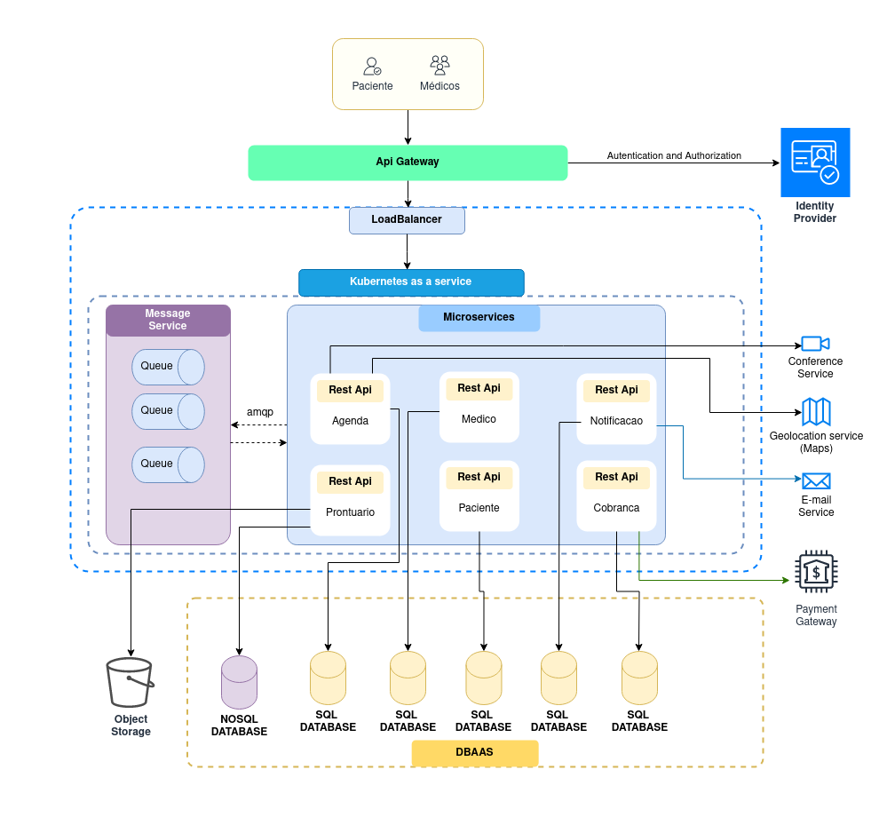
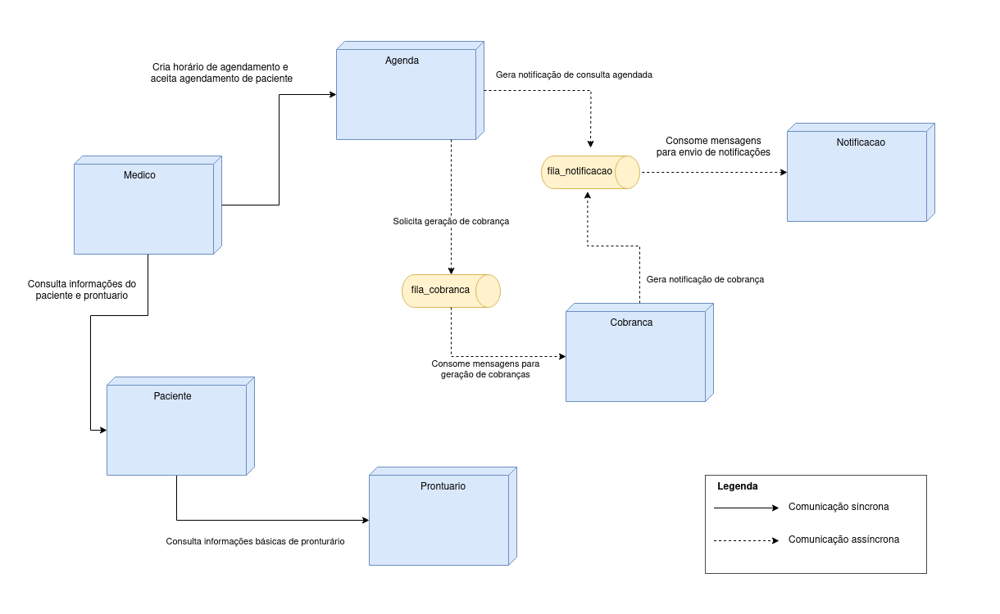

# Descrição do Projeto
Elaboração de uma arquitetura de software para um healthtech focada em telemedicina
## Requisitos 
- Agendamento de consultas;
- Pesquisa de médicos;
- Inclusão de dados de prontuário médico;
- Inclusão de arquivos anexos ao prontuário, ex: exames;
- Notificações de consultas agendadas;
- Notificações de cobranças referentes as consultas.
## Requisitos não funcionais
- Elasticidade
- Alta disponibilidade
- Camada de segurança extra para dados sensíveis, ex: prontuário médico.

## Arquitetura HealthTech
Diagrama com a visão de alto nível da arquitetura e seus componentes.

## Comunicação entre microserviços
Diagrama que demonstra a comunicação básica entre cada microserviço

## Registro de decisões de arquitetura(ADRs)
- [ADR 1. Uso de arquitetura de microserviços e Kubernetes](adrs/adr1.md)
- [ADR 2. Uso de mensageria](adrs/adr2.md)
- [ADR 3. Uso da aplicação rabbitmq para mensageria como um serviço do kubernetes](adrs/adr3.md)
- [ADR 5. Uso de Api Gateway](adrs/adr5.md)
- [ADR 6. Uso de Identity Provider](adrs/adr6.md)
- [ADR 7. Uso de Storage Object para arquivos anexos de prontuário](adrs/adr7.md)
- [ADR 8. Uso de Mysql como serviço DBAAS](adrs/adr8.md)
- [ADR 9. Microserviços separados para medico e paciente](adrs/adr9.md)